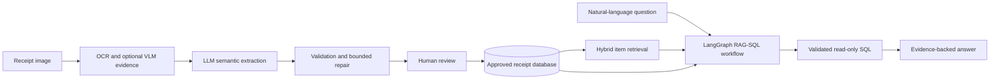

# Document Intelligence for Receipts

[](https://github.com/ftolou/document-intelligence/actions/workflows/ci.yml)


A local-first system that turns receipt images into **reviewed structured data** and answers natural-language questions through **hybrid retrieval and validated read-only SQL**.

**Local-first · Human-reviewed · Evidence-bound**

<!--
Replace this comment with a genuine, anonymized screenshot before publishing:

-->


## Model-call usage and cost

The **Models** tab records provider-reported input/output tokens and timing for each instrumented LLM call. Configure input and output prices per one million tokens to calculate scenario costs without hardcoding provider pricing. See `docs/MODEL_CALL_DASHBOARD.md`.

## Why I built it

I first worked on receipt understanding with a CRNN-based OCR pipeline. Character recognition was not the reason I stopped that project: the unresolved problem was semantic interpretation. A system still had to decide which lines were products, how quantities and discounts related to prices, and which values represented totals, payments, or taxes.

Modern OCR, vision-language models, embeddings, and LLMs make that semantic layer practical. But a useful document system cannot stop at a model response. It also needs deterministic checks, bounded repair, human approval, traceability, persistence, and a safe way to calculate answers from reviewed data.

This repository implements that complete path for German and European retail receipts.

## System at a glance



The application connects two workflows:

- **Extraction:** image → OCR/VLM evidence → structured receipt → validation → human approval.
- **Analytics:** question → semantic item resolution → validated SQL → grounded answer.

## Results and validation

The current published evidence focuses on software and workflow validation. It does not yet claim a statistically representative model-quality benchmark.

| Check | Current evidence |
|---|---:|
| Containerized unit test suite | **198 passed** |
| Deterministic RAG-SQL regression corpus | **1 passed** |
| Python compilation and scoped Ruff checks | Automated in GitHub Actions |
| Frontend JavaScript syntax | Automated in GitHub Actions |
| Docker application build and dependency compatibility | Automated in GitHub Actions |

The next quantitative milestone is a reviewed benchmark covering extraction accuracy, retrieval Recall@5/MRR, SQL validity, `insufficient_info` behavior, and per-node latency. Until that dataset is complete, those metrics are intentionally not estimated.

<!--
Replace this comment with a genuine screenshot showing a grounded answer:

-->

## Key design decisions

### Staged extraction with an explicit trust boundary

OCR and optional VLM output are treated as evidence rather than final truth. An LLM performs semantic extraction, while deterministic code validates schema, arithmetic, totals, and consistency before bounded repair is considered. A human reviewer can correct the result, and only approved data is used for downstream analytics.

See [`src/receipt_intelligence/extraction/`](src/receipt_intelligence/extraction/) and [`docs/HUMAN_REVIEW.md`](docs/HUMAN_REVIEW.md).

### Retrieval identifies products; SQL performs calculations

Semantic matching and numerical computation are separated deliberately. Dense and lexical retrieval resolve product concepts such as “shoes” or “mineral water” to concrete reviewed item IDs. SQL then performs exact filtering, grouping, comparison, and aggregation over those protected IDs.

See [`src/receipt_intelligence/rag/`](src/receipt_intelligence/rag/) and [`docs/RAG_SEMANTIC_RETRIEVAL.md`](docs/RAG_SEMANTIC_RETRIEVAL.md).

### The LLM proposes SQL but never executes it

LangGraph makes analysis, planning, validation, execution, repair, and answer formatting explicit. The application composes one process-scoped RAG-SQL engine and compiled graph at startup, then reuses them across query requests. The optional graph-library import is isolated behind an orchestration adapter. The validator accepts only bounded read-only queries against curated analytics views and approved functions. Invalid or unsupported plans are rejected, while missing evidence produces `insufficient_info` instead of an invented answer.

See [`src/receipt_intelligence/rag_sql/`](src/receipt_intelligence/rag_sql/), [`docs/RAG_SQL_ENGINE.md`](docs/RAG_SQL_ENGINE.md), and [`docs/RAG_SQL_RUNTIME_LIFECYCLE.md`](docs/RAG_SQL_RUNTIME_LIFECYCLE.md).

### Local models are isolated behind replaceable services

The application uses Ollama for local generation and embeddings, while the optional GPU-intensive VLM runs as a separate service. Heavy runtime images are separated from thin application images so normal code changes do not rebuild the complete AI stack. Model-specific integration remains behind explicit adapters and settings rather than spreading across the application.

See [`docs/ARCHITECTURE.md`](docs/ARCHITECTURE.md) and [`docs/DOCKER_IMAGE_DESIGN.md`](docs/DOCKER_IMAGE_DESIGN.md).

## Technical trade-offs

| Decision | Trade-off |
|---|---|
| LLM-first parsing plus deterministic validation | Handles diverse layouts better than a rule-only parser, but requires strict contracts and post-validation. |
| Optional VLM evidence | Improves difficult layout interpretation, but increases latency and GPU demand. |
| Human approval before analytics | Adds review effort, but establishes a clear source of truth for exact calculations. |
| Hybrid dense and lexical retrieval | Improves semantic and exact-term matching, but requires fusion and separate retrieval evaluation. |
| Resolve item IDs before SQL planning | Adds an explicit resolution stage, but prevents fragile product matching inside generated SQL. |
| Deterministic SQL validation and rendering | Restricts open-ended generation, but keeps execution and factual output under application control. |
| Local-first deployment | Preserves privacy and inspectability, but requires local model and container resources. |

## Quick start

### Prerequisites

- Windows 11 with Docker Desktop
- NVIDIA GPU support for the default VLM service
- Ollama running on the host
- A compatible local generation model, for example `gemma4`
- A compatible embedding model, for example `embeddinggemma`

### 1. Configure the environment

```powershell
Copy-Item .env.example .env
```

Review model names, model-cache paths, and GPU settings in `.env`.

### 2. Build the runtime and application images

```powershell
.\scripts\docker\build-app-runtime.ps1
.\scripts\docker\build-app.ps1
.\scripts\docker\build-vlm-runtime.ps1
.\scripts\docker\build-vlm.ps1
```

The runtime images contain heavy dependencies. Normal source changes use thin application images or development bind mounts and do not require rebuilding the heavy runtimes.

### 3. Start the application

```powershell
.\start_windows.ps1
```

Open:

```text
http://localhost:7860
```

Check the optional VLM service:

```powershell
Invoke-RestMethod http://localhost:7870/health | ConvertTo-Json -Depth 5
```

## Typical workflow

1. Upload a receipt image.
2. Inspect extraction, validation, and repair progress.
3. Review and correct the structured receipt.
4. Approve the result and persist it to SQLite.
5. Build or update the reviewed-item embedding index.
6. Ask an analytical question in natural language.

Example query:

```powershell
python scripts/demo_rag_sql_query.py "Wie viel habe ich für Schuhe ausgegeben?"
```

## Development and quality checks

```powershell
python scripts/run_tests.py
python scripts/run_test_profile.py regression
python scripts/run_quality_checks.py
```

GitHub Actions covers compilation, linting, frontend syntax, Docker builds, dependency compatibility, unit tests, the deterministic query regression corpus, and CLI packaging.

## Current scope and limitations

- The extraction workflow is currently optimized for German and European retail receipts.
- Human review remains part of the trust boundary; unreviewed model output is not treated as accounting truth.
- The default setup targets a local single-user environment, not a hardened multi-tenant SaaS deployment.
- VLM processing is computationally expensive and intentionally isolated as an optional service.
- Quality depends on the selected local models and the diversity of the reviewed receipt corpus.
- A representative public benchmark for extraction, retrieval, SQL validity, and latency is still in preparation.
- The project is not financial, accounting, or tax software.

## Documentation

- [Architecture](docs/ARCHITECTURE.md)
- [Human review](docs/HUMAN_REVIEW.md)
- [RAG-SQL engine](docs/RAG_SQL_ENGINE.md)
- [Semantic retrieval](docs/RAG_SEMANTIC_RETRIEVAL.md)
- [Reviewed product semantics](docs/RAG_SQL_PRODUCT_SEMANTICS.md)
- [Observability and readiness](docs/operations/OBSERVABILITY.md)
- [Docker image design](docs/DOCKER_IMAGE_DESIGN.md)
- [Development guide](docs/DEVELOPMENT.md)
- [Complete documentation index](docs/index.md)
