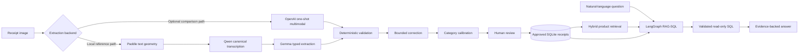

# Document Intelligence for Receipts

Local-first, evidence-bound receipt extraction and analytics with human review as the trust boundary.

The project turns receipt images into reviewed structured data and then makes that data queryable
through hybrid retrieval and validated read-only SQL. The reference implementation runs locally
with Paddle, Qwen and Gemma; an optional OpenAI one-shot backend is available for controlled
cloud/model comparison.

## Why this project exists

An earlier receipt-recognition project reached a point where OCR quality was no longer the main
problem. The harder problem was semantic interpretation: a receipt can be transcribed correctly
while totals, tender amounts, change, discounts or multiline items are still assigned the wrong
meaning.

Modern multimodal and language models reopened that problem, but replacing deterministic code with
one unconstrained LLM call was not sufficient. The architecture therefore separates evidence
capture, semantic interpretation, validation, correction and approval.

A representative failure drove this design: the source text correctly contained a purchase total,
cash tender and change, while a monolithic parser still classified the tender amount as the receipt
total. The current pipeline treats that as a semantic-boundary problem rather than an OCR problem.

## System at a glance



The OpenAI backend bypasses the local Paddle/Qwen/Gemma extraction stages and rejoins the
application at deterministic validation, category calibration, final publication, review and
persistence.

## Core engineering decisions

| Problem observed | Architectural decision |
|---|---|
| Correct text could still be interpreted incorrectly | Separate transcription from semantic extraction |
| OCR boxes and model transcription could create duplicate/conflicting evidence | Use one canonical ordered transcription as the semantic evidence surface |
| Broad deterministic repair was brittle | Keep deterministic validation read-only |
| Generic LLM repair could produce broad or unsupported patches | Use failure-specific, source-evidence correction with typed scope and regression gates |
| Local models sometimes violate output contracts | Validate typed boundaries and retry only inside bounded stages |
| Natural-language analytics can produce unsafe or semantically weak SQL | Resolve reviewed entities first, then validate read-only SQL deterministically |
| Extracted data is probabilistic | Human approval establishes the analytics source of truth |

See [Engineering evolution](docs/ENGINEERING_EVOLUTION.md) for the failure modes that led to these
choices.

## Extraction workflow

The local reference path has one production workflow:

1. **Paddle geometry** detects text regions. Paddle-recognized text is not treated as semantic truth.
2. **Qwen transcription** reads ordered, non-overlapping crops and emits the canonical textual
   evidence.
3. **Gemma specialists** extract scalar fields and items into typed contracts.
4. **Deterministic validation** checks arithmetic and consistency without mutating receipt values.
5. **Bounded correction** may propose source-supported changes for specific validation failures;
   Python applies only allowed typed patches and rejects regressions.
6. **Categorization** adds calibrated category metadata without changing receipt arithmetic.
7. **Human review** approves the record before it becomes available to retrieval and analytics.

The supported application entry point is:

```python
run_receipt_extraction(ExtractionRequest(...))
```

There is no runtime strategy switch, preliminary full-image OCR pipeline, remote VLM service or
executable legacy extraction fallback.

## Ask Your Receipts

Approved receipts feed a separate analytics path:

- hybrid lexical + embedding retrieval resolves product concepts against reviewed data;
- LangGraph orchestrates the query workflow;
- an LLM may propose a typed query plan;
- deterministic validation authorizes only read-only SQL over curated analytics structures;
- the final answer is grounded in the approved receipt records used to compute it.

The LLM does not receive authority to execute arbitrary SQL.

## Human review and traceability

Human review is not a cosmetic fallback. It is the boundary between probabilistic extraction and
trusted application data. The UI maintains a dedicated review queue, validation context, editable
receipt fields and item rows before approval/import.

The application also records model-call observability including provider/model, operation, token
usage, latency, generation timing, failures and configurable cost estimates.

## Local-first and optional cloud inference

The default architecture is designed for a local single-user deployment:

```text
receipt-app  Flask UI/API, Paddle geometry, extraction, review, SQLite and RAG-SQL
Ollama       Qwen/Gemma generation and embedding models on the host
```

`ExtractionRequest.extraction_backend` also supports an optional OpenAI one-shot path. It is kept
behind the same application boundary so local and cloud approaches can be compared without
duplicating review, persistence or analytics workflows.

## Quick start

Prerequisites are Docker Desktop or Python 3.11, reachable Ollama, and the configured local models.

```powershell
Copy-Item .env.example .env
ollama pull qwen3.5:4b
ollama pull gemma4:latest
ollama pull embeddinggemma:latest
.\scripts\docker\build-app-runtime.ps1
.\scripts\docker\build-app.ps1
.\start_windows.ps1
```

Open `http://localhost:7860`.

Run one image or a folder directly:

```powershell
python scripts/run_receipt_pipeline.py test_receipts/example.jpg
python scripts/run_receipt_images_folder.py test_receipts
```

## Development and validation

```powershell
python scripts/run_quality_checks.py
python scripts/run_tests.py
python scripts/run_test_profile.py regression
```

The same checks can be run in the application container to validate the intended Python 3.11
runtime:

```powershell
docker compose `
  -f docker-compose.yml `
  -f docker-compose.dev.yml `
  run --rm receipt-app `
  sh -lc "python -m pip install -r requirements/dev.txt && python scripts/run_quality_checks.py && python scripts/run_tests.py"
```

Generated runtime state belongs under `var/`. Approved receipt data in SQLite is the source of truth
for retrieval and analytics.

## Current scope

- Extraction is optimized for German and European retail receipts.
- Human review remains part of the trust boundary.
- The reference deployment targets a local single-user environment.
- Extraction quality depends on the configured models and the document domain.
- The OpenAI path is an optional comparison/deployment backend, not the default local path.
- This project is not financial, accounting or tax software.

## Documentation

- [Engineering evolution](docs/ENGINEERING_EVOLUTION.md)
- [Architecture](docs/ARCHITECTURE.md)
- [Extraction configuration](docs/EXTRACTION_CONFIGURATION.md)
- [Human review](docs/HUMAN_REVIEW.md)
- [Background jobs](docs/BACKGROUND_JOB_EXECUTION.md)
- [RAG-SQL engine](docs/RAG_SQL_ENGINE.md)
- [Semantic retrieval](docs/RAG_SEMANTIC_RETRIEVAL.md)
- [Model-call dashboard](docs/MODEL_CALL_DASHBOARD.md)
- [Observability and readiness](docs/operations/OBSERVABILITY.md)
- [Documentation index](docs/index.md)
