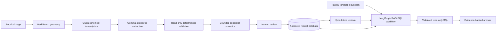

# Document Intelligence for Receipts

A local-first receipt workflow combining image transcription, structured extraction,
deterministic validation, human review, SQLite persistence, and evidence-grounded analytics.

## System at a glance



The extraction workflow has one production path:

1. Paddle detects text geometry but its recognized text is not trusted.
2. Qwen transcribes ordered, non-overlapping image crops.
3. Gemma extracts scalar fields and items into typed contracts.
4. Deterministic validation checks arithmetic and consistency without changing values.
5. Source-evidence specialists may propose corrections; regression checks gate acceptance.
6. Optional categorization adds category metadata without changing receipt arithmetic.
7. Human review establishes the source of truth used by analytics.

## Design boundaries

- `run_receipt_extraction(ExtractionRequest(...))` is the canonical typed API.
- `run_integrated_receipt_pipeline(...)` is a deprecated wrapper that invokes the same workflow.
- Extraction is image-first; there is no preliminary full-image OCR pass or OCR-JSON mode.
- Paddle geometry runs in the application process. There is no separate `receipt-vlm` service.
- Stored legacy receipts and stable artifact filenames remain readable.
- The LLM may propose SQL, but deterministic validation authorizes read-only execution.

## Quick start

Prerequisites are Python 3.11 or Docker Desktop, reachable Ollama, and the configured Qwen and
Gemma models.

```powershell
Copy-Item .env.example .env
ollama pull qwen3.5:4b
ollama pull gemma4:latest
ollama pull embeddinggemma:latest
.\scripts\docker\build-app-runtime.ps1
.\scripts\docker\build-app.ps1
.\start_windows.ps1
```

Open `http://localhost:7860`.

Run one image or a folder directly:

```powershell
python scripts/run_receipt_pipeline.py test_receipts/example.jpg
python scripts/run_receipt_images_folder.py test_receipts
```

## Development

```powershell
python scripts/run_tests.py
python scripts/run_test_profile.py regression
python scripts/run_quality_checks.py
```

Generated state belongs under `var/`. Approved receipt data in SQLite is the source of truth for
retrieval and analytics.

## Current scope

- Extraction is optimized for German and European retail receipts.
- Human review remains part of the trust boundary.
- The default deployment targets a local single-user environment.
- Quality depends on the selected local models and reviewed receipt corpus.
- This project is not financial, accounting, or tax software.

## Documentation

- [Architecture](docs/ARCHITECTURE.md)
- [Extraction configuration](docs/EXTRACTION_CONFIGURATION.md)
- [Human review](docs/HUMAN_REVIEW.md)
- [Background jobs](docs/BACKGROUND_JOB_EXECUTION.md)
- [RAG-SQL engine](docs/RAG_SQL_ENGINE.md)
- [Semantic retrieval](docs/RAG_SEMANTIC_RETRIEVAL.md)
- [Observability and readiness](docs/operations/OBSERVABILITY.md)
