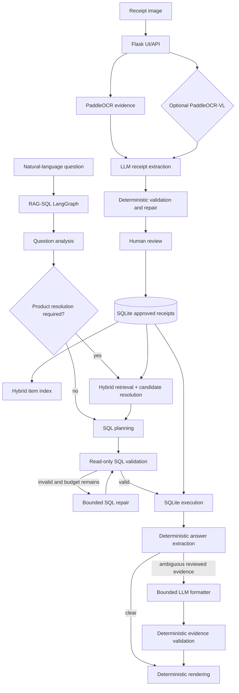

# Architecture

Document Intelligence Pipeline is a local-first document automation system currently specialized for receipts. Approved
receipt data is the source of truth for later analytics.



## Query architecture

RAG-SQL is the only application query engine. LangGraph is the orchestration
runtime, not a separate query mode. The graph makes routing and bounded loops
explicit:

- analysis can finish as `needs_clarification` or `unsupported`;
- product entities are retrieved and resolved one at a time;
- SQL validation can enter a bounded repair loop;
- execution and answer extraction have controlled error states;
- only evidence-rich ambiguity enters the bounded LLM formatter;
- formatter values and item IDs are deterministically validated before rendering;
- every transition is represented in diagnostics.

The LLM never executes SQL. It produces typed analysis and plan contracts. A
deterministic validator permits only curated analytics views, approved
functions, named parameters, and read-only statements. SQLite calculations and final application rendering remain deterministic.
The optional answer-formatting model may normalize ambiguous reviewed evidence,
but it cannot bypass the evidence validator.

## Runtime services

```text
receipt-app  Flask UI/API, OCR, extraction, review, SQLite, hybrid RAG, RAG-SQL LangGraph
receipt-vlm  Optional GPU PaddleOCR-VL evidence service
Ollama       Local generation and embedding models on the host
```

Generated state belongs under `var/`; model caches remain external or mounted.
