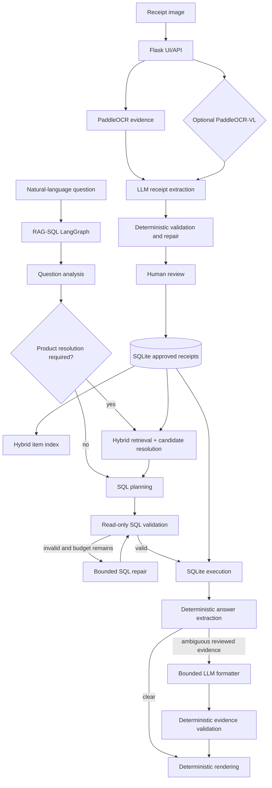

# Architecture

Document Intelligence Pipeline is a local-first document automation system currently specialized for receipts. Approved
receipt data is the source of truth for later analytics.




## HTTP and application boundary

Flask blueprints are thin transport adapters. They parse requests, call explicit
application use cases, and convert transport-neutral resource references into
HTTP links. Job, receipt, review, query, and runtime orchestration lives under
`application/use_cases/`; concrete stores and processing services are assembled
only in the composition boundary. Receipt and batch work is submitted through a
bounded `JobDispatcher`; routes and use cases never create worker threads. Job
state, attempts, timestamps, errors, and serializable dispatch requests are
persisted under `var/jobs`, while filesystem claims prevent duplicate execution
across app processes. See [Application use-case boundary](APPLICATION_USE_CASES.md)
and [Background job execution](BACKGROUND_JOB_EXECUTION.md).

## Query architecture

RAG-SQL is the only application query engine. The application composes one
process-scoped query engine at startup and reuses its model gateways, semantic
retriever, SQL executor, and compiled graph for every request. LangGraph is an
isolated orchestration adapter, not a dependency of the RAG-SQL models,
planner, validator, or storage contracts. The graph makes routing and bounded
loops explicit:

- analysis can finish as `needs_clarification` or `unsupported`;
- product entities are retrieved and resolved one at a time;
- SQL validation can enter a bounded repair loop;
- execution and answer extraction have controlled error states;
- only evidence-rich ambiguity enters the bounded LLM formatter;
- formatter values and item IDs are deterministically validated before rendering;
- every transition is represented in diagnostics.

The LLM never executes SQL. It produces typed analysis and plan contracts. A
deterministic validator permits only curated analytics views, approved
functions, named parameters, and read-only statements. SQLite calculations and final application rendering remain deterministic.
The optional answer-formatting model may normalize ambiguous reviewed evidence,
but it cannot bypass the evidence validator. Runtime ownership and shutdown are
documented in [RAG-SQL runtime lifecycle](RAG_SQL_RUNTIME_LIFECYCLE.md).

## Observability boundary

Extraction and query services emit typed application events through a neutral
`EventSink` port. JSON snapshots and JSONL persistence are outer adapters, so
feature workflows do not depend on logging backends or provider-specific metric
types. Model-call diagnostics expose neutral provider, model, token, and timing
fields; historical Ollama keys remain compatibility aliases only. Readiness is a
runtime concern under `runtime/`, not an observability dependency on storage.
See [Observability and readiness](operations/OBSERVABILITY.md).

## Runtime services

```text
receipt-app  Flask UI/API, OCR, extraction, review, SQLite, hybrid RAG, RAG-SQL LangGraph
receipt-vlm  Optional GPU PaddleOCR-VL evidence service
Ollama       Local generation and embedding models on the host
```

Generated state belongs under `var/`; model caches remain external or mounted.
