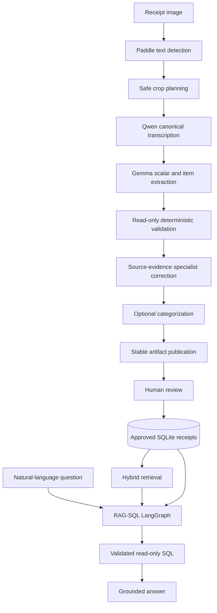

# Architecture



## Extraction boundary

`run_receipt_extraction` accepts one immutable `ExtractionRequest` containing the source image
and model/runtime settings. `build_extraction_workflow` defines the only production workflow.
There is no runtime strategy selection, preliminary OCR job, remote VLM service, or fallback to
the removed OCR/VLM parser.

The workflow stages exchange typed artifacts through `ExtractionContext`. Model calls use
provider-neutral text and multimodal gateways, and Paddle is isolated behind the text-detection
port. Deterministic validation never mutates the receipt. Correction candidates are accepted only
when targeted validation failures improve without regressions.

## Generation boundary

Generic extraction and query workflows express prompts, optional images, structured-output
schemas, output limits, sampling intent, and timeouts through the Core generation ports. Ollama
and OpenAI adapters translate those requests into provider transports and normalize provider
failures. Provider and opaque model identifiers are selected by runtime composition; workflows
do not infer capabilities from model names.

Provider-specific tuning is configured on concrete adapters. An unset temperature is omitted,
while an explicit `0.0` is forwarded unchanged. Structured responses are validated against the
original neutral JSON Schema after provider transport translation. Schemas that cannot be
represented faithfully in a provider's strict mode use JSON mode without narrowing Core's schema.

## Application boundary

Flask blueprints parse transport data and call application use cases. Receipt and batch work is
submitted through the bounded `JobDispatcher`. Job state, attempts, errors, and resources are
persisted under `var/jobs`.

## Compatibility boundary

Stable final artifact names and receipt-schema adapters remain so existing jobs, review records,
and relational imports stay readable. Compatibility is limited to persisted data contracts; there
is no executable legacy extraction API or fallback pipeline.

## Query boundary

RAG-SQL resolves reviewed product concepts, produces typed plans, validates read-only SQL against
curated analytics views, and executes only approved statements. The LLM never executes SQL.

## Runtime services

```text
receipt-app  Flask UI/API, Paddle geometry, extraction, review, SQLite, and RAG-SQL
Ollama       Qwen/Gemma generation and embedding models on the host
```
